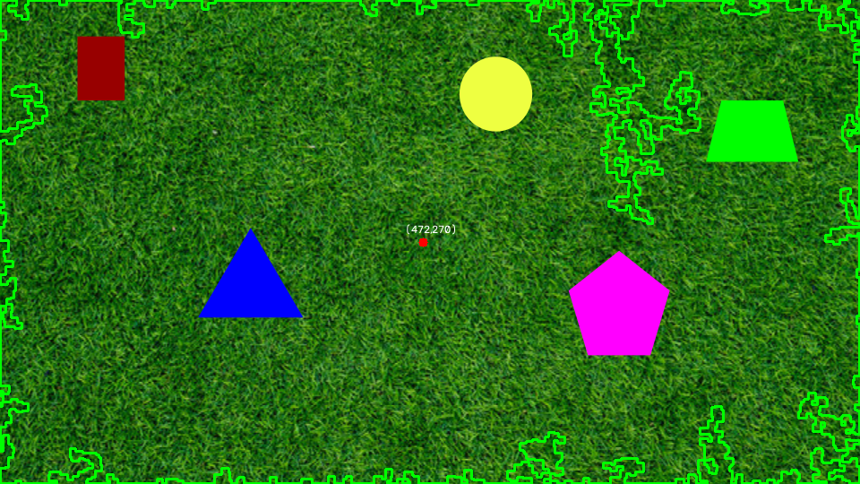
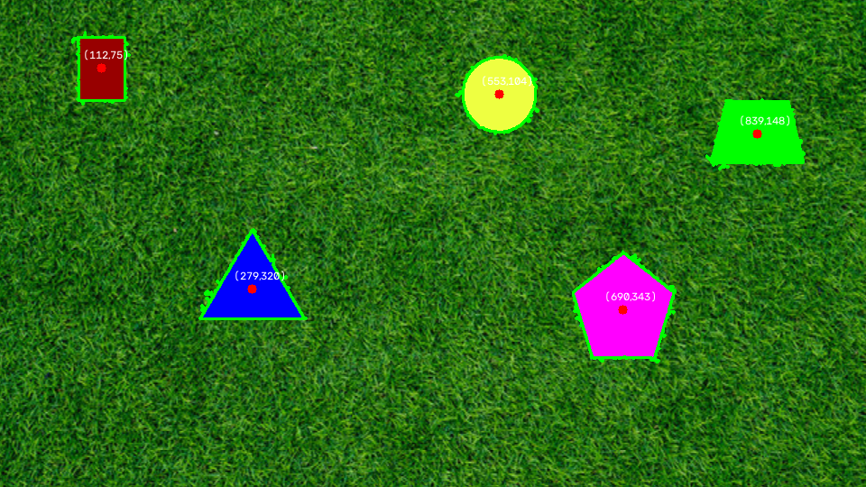
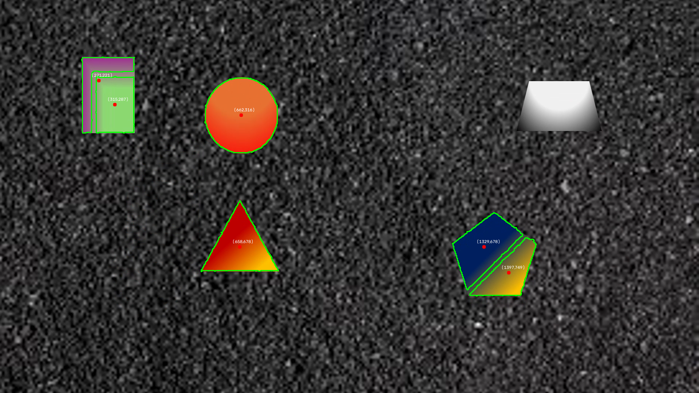
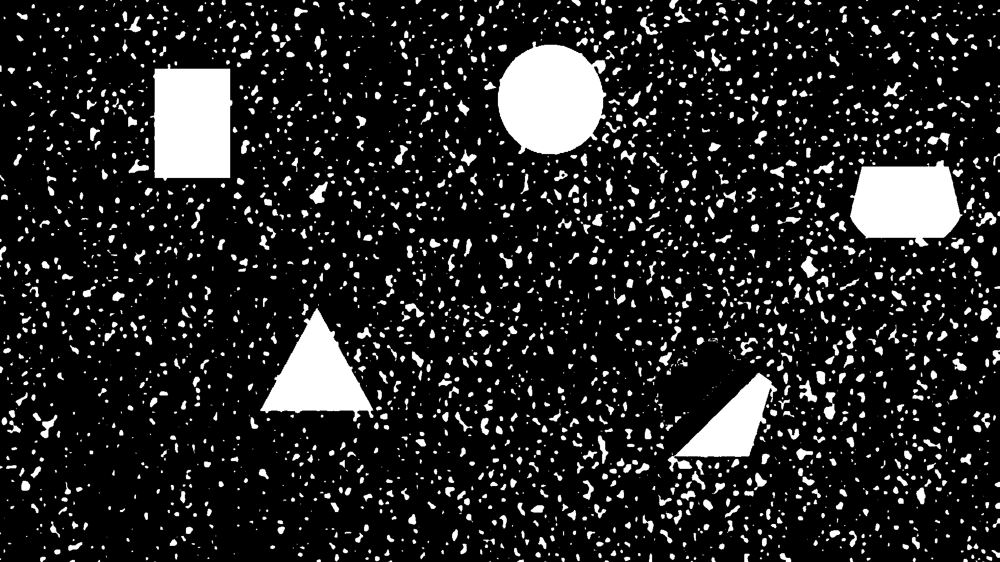
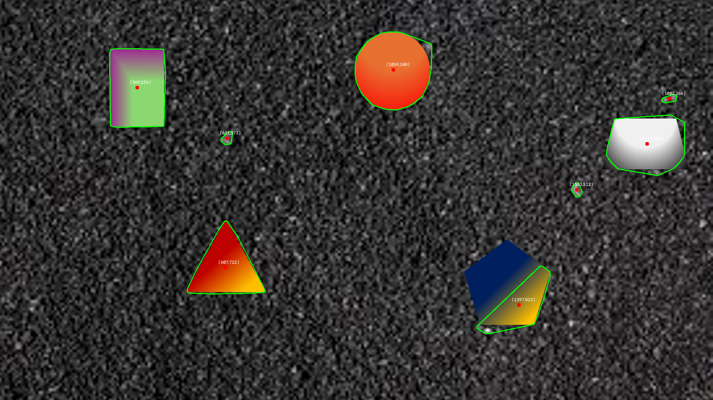

# PennAir Vision — Aerial Robotics Software Challenge

This repository contains my submission for the PennAir Aerial Robotics software
challenge: shape detection on a static image (Part 1), on video (Part 2), made
background-agnostic (Part 3), extended to 3D using a pinhole camera model
(Part 4), and wrapped into a ROS 2 package (Part 5).

- **Author:** Wade
- **Dev environment:** macOS host → Ubuntu VM (UTM) → Docker container (ROS 2 Humble)

---

## Part A — How to Run This Project

### Repo layout

```
.
├── part1_static.py            # Part 1: shape detection on the static image
├── part2_video.py             # Part 2: same algorithm applied frame-by-frame to video
├── part3_hard_video.py        # Part 3: background-agnostic version, RGB + noise based
├── part4_3d.py                # Part 4: adds depth (Z) / 3D coordinates
├── src/
│   ├── detector.py            # Core detection algorithms shared by part1-4 scripts
│   └── utils.py
├── assets/                    # Input test files provided by PennAir
│   ├── PennAir 2024 App Static.png
│   ├── PennAir 2024 App Dynamic.mp4
│   └── PennAir 2024 App Dynamic Hard.mp4
├── outputs_hsv/               # Part 1 result + mask debug images
├── outputs_hsv_process/       # Part 1/3 step-by-step HSV pipeline debug images
├── outputs_rgb_part3/         # Part 3 RGB + noise-mask debug images
├── outputs/                   # Part 4 3D result images
├── pennair_vision/            # Part 5: ROS 2 package
│   ├── pennair_vision/
│   │   ├── detector.py            # Core detection algorithms (ROS-side copy, used by Parts 1-4 logic)
│   │   ├── camera_node.py         # Publishes video frames as a ROS 2 topic
│   │   └── detection_node.py      # Subscribes to frames, runs detection + 3D math, publishes pose
│   ├── launch/pennair_vision.launch.py
│   ├── package.xml / setup.py / setup.cfg
│   └── test/
└── README.md
```

### Part 1 — Shape detection on a static image

```bash
python3 part1_static.py
```

Reads `assets/PennAir 2024 App Static.png`, detects the shapes, draws their
outlines, marks their centers, and saves the annotated result + debug masks
to `outputs_hsv/`.

### Part 2 — Shape detection on video

```bash
python3 part2_video.py
```

Reads `assets/PennAir 2024 App Dynamic.mp4` and processes it **frame by
frame** (as a stream, not all at once), drawing outlines/centers on every
frame and writing an annotated output video. See it in action below
(demo recording also saved at `demo_videos/part2_video_demo.mp4`):


https://github.com/user-attachments/assets/f8aced29-44c7-43ea-9d74-3595fb826997

### Part 3 — Background-agnostic detection

```bash
python3 part3_hard_video.py
```

Same idea as Part 2, but works regardless of background color/texture. Tested
on `assets/PennAir 2024 App Dynamic Hard.mp4`; debug output for frame 0 is
saved to `outputs_rgb_part3/`. See the result on the hard video below
(demo recording also saved at `demo_videos/part3_hard_video_demo.mp4`):

https://github.com/user-attachments/assets/b1c32a32-a691-41c7-867c-0faed6bb084e

### Part 4 — 3D coordinates

```bash
python3 part4_3d.py
```

Takes the Part 3 output, uses the known reference circle (radius = 10 in) plus
the given camera intrinsic matrix to compute depth Z and the 3D (X, Y, Z) of
every detected object's center, using the circle's pixel size as the depth
reference. Result saved to `outputs/part4_3d_result.png`.

### Part 5 — ROS 2 integration

1. Copy the package into a ROS 2 workspace:
   ```bash
   cp -r pennair_vision ~/ros2_ws/src/
   ```
2. **Before building**, open `pennair_vision/camera_node.py` and set
   `self.video_path` to wherever you placed the test video on your machine
   (it currently points at `/ros2_ws/assets/PennAir 2024 App Dynamic Hard.mp4`
   inside my own container).
3. Build the workspace:
   ```bash
   cd ~/ros2_ws
   colcon build --packages-select pennair_vision --symlink-install
   source install/setup.bash
   ```
4. Launch both nodes with one command:
   ```bash
   ros2 launch pennair_vision pennair_vision.launch.py
   ```
   This starts:
   - `camera_node` — streams the video file as `sensor_msgs/Image` on `/camera/image_raw`
   - `detection_node` — runs the Part 3 detection algorithm on each frame, does
     the Part 4 pinhole-camera depth calculation, and publishes a
     `geometry_msgs/PointStamped` on `/target_3d_pose`
5. In a second terminal, watch the live 3D output:
   ```bash
   source ~/ros2_ws/install/setup.bash
   ros2 topic echo /target_3d_pose
   ```

---

## Part B — Development Journey & Key Techniques

### Part 1 & 2 — from grayscale to a clean HSV mask

- **First attempt: plain grayscale threshold.** The lighting/contrast between
  the shapes and the grass background wasn't consistent enough — some
  shapes blended into the background and were missed or mis-detected.
  
- **Second attempt: hand-picked HSV range on a `hsv` branch.** Worked better,
  but broke down whenever a shape's color was close to the background's.
- **Fix, with help from office hours:** used an interactive HSV-filter tool to
  find a clean HSV range that isolates the background well, producing a much
  better mask.
- **Contour extraction:** `cv2.inRange()` was tuned to match the *background*,
  so the raw mask is white where the background is and black where the shapes
  are. The mask is inverted (`cv2.bitwise_not`) before `findContours`, so the
  **shapes** become the white foreground blobs that `RETR_EXTERNAL` picks up
  (see "My Notes for You" below for the full reasoning on this).
- **Cleanup:** the initial mask was still noisy (small speckles from grass
  texture), which threw off the centroid calculation. The two images below
  show the mask before and after cleanup:

  | Mask before cleanup (noisy) | Mask after cleanup (clean contour) |
  |---|---|
  |  |  |

  Morphological cleanup (open/close, see below) plus a minimum-contour-area
  filter removed the noise and gave clean, stable outlines and centers.

### Part 3 — background-agnostic detection (RGB + noise, not HSV)

Reusing the Part 1/2 HSV approach failed on the harder video for two reasons:
1. Gradient-shaded shapes sometimes got split into two separate blobs where
   the gradient crossed a hue boundary:
   
2. A fixed HSV range obviously can't generalize to an *arbitrary* background —
   hand-tuning a mask from a website isn't a real solution if the background
   color is unknown ahead of time.

New approach, on a `rgb_strategy` branch:
- **Background sampling:** on the first frame, sample a fixed-size patch and
  take the most common RGB combination as "the background" — this makes the
  algorithm work with *any* background, not just the black one in the test
  video.
- **Color mask:** per-pixel Euclidean distance from that background RGB;
  anything far enough away is foreground. The image below is the best color
  mask I was able to get on frame 0 after tuning the morphological kernel
  size to `(3, 3)` — beyond this point, further kernel tuning stopped making
  a difference, which is a limitation of the current approach that I'd want
  to revisit:
  
- **Noise mask:** compare each pixel's local high-frequency noise level
  against the background's noise profile — a shape with a *different* texture
  frequency than the background gets flagged as foreground even when its
  color is close to the background color, and this also helps stop a single
  gradient shape from being split into two.
- **Combine + clean:** the color mask and noise mask are OR'd together, then
  cleaned with morphological open/close before finding contours. This is the
  best result I was able to achieve on frame 0 with this approach:
  
- **Known remaining issues (flagged for future work):** the outlines aren't
  perfectly tight to the object boundary, background noise isn't 100%
  eliminated, and two overlapping objects aren't yet separated correctly.

### Part 4 — making it 3D

Part 3's detections feed directly into Part 4: the known reference circle
(10 in radius) gives a pixel-radius-to-real-world-size ratio, which — combined
with the camera's intrinsic matrix — is used to solve for depth (Z) via the
pinhole camera model, and then back-project each detected center's (u, v)
pixel coordinates into (X, Y, Z) in camera-frame coordinates.

### Part 5 — ROS 2 integration

- **Environment:** Mac → UTM (Ubuntu VM) → Docker (ROS 2 Humble), to keep the
  ROS 2 dependency stack clean and reproducible.
- **`detector.py`** holds the reusable detection functions so both the
  standalone scripts and the ROS 2 nodes call the same, single implementation.
- **`camera_node`** re-publishes the test video as a live `Image` topic (as if
  it were a real camera feed); **`detection_node`** subscribes, runs the Part
  3 detector, does the Part 4 3D math, and publishes `/target_3d_pose`.

**Problems hit along the way:**

| Problem | Symptom | Fix |
|---|---|---|
| `cv_bridge` encoding mismatch | `CvBridgeError: [8UC3] is not a color format` when converting frames between nodes | Standardized both publisher and subscriber on `passthrough` encoding instead of relying on an RGB/BGR conversion, which avoided the incompatibility entirely |
| Host vs. container confusion | `ros2: command not found` | The terminal was actually on the Ubuntu VM host, not inside the Docker container — fixed by `sudo docker exec -it <container_id> bash` and re-sourcing `/opt/ros/humble/setup.bash` |
| Launch file "missing" | `ros2 launch` couldn't find the launch file in the install `share` directory | `setup.py`'s `data_files` wasn't copying the `launch/` folder — added the missing `data_files` entry, cleared `build/`/`install/`, and rebuilt with `--symlink-install` |

### Key techniques used, end to end

- HSV color-space thresholding + mask inversion + contour extraction (Parts 1–2)
- Morphological cleanup: `MORPH_CLOSE` (fill gaps within a blob),
  `MORPH_OPEN` (strip small noise blobs), and `dilate` (merge sparse noise
  points) used at different stages depending on what needed fixing
- RGB color-distance masking + local noise-frequency comparison for
  background-agnostic segmentation (Part 3)
- Convex hull + image moments for robust outline/centroid extraction
- Pinhole camera model (intrinsic matrix + known reference object size) for
  monocular depth estimation (Part 4)
- ROS 2 nodes/topics/launch files, Docker-based reproducible environment (Part 5)

### Known limitations / future work

- Overlapping objects are not yet separated in Part 3.
- Contour edges aren't perfectly tight to object boundaries under heavy noise.
- Detection could be made more efficient for true real-time use (e.g.
  avoiding recomputation of the noise mask over the whole frame every frame).
